# ========================================
# 1st-Stage Reuseable Launch Vehicle AFT Skirt Ascent/Reentry Venting Thermal Analysis using VISSIM:
# ========================================

## 1st-Stage Reuseable Launch Vehicle AFT Skirt Ascent/Reentry Venting Thermal Analysis using VISSIM.

##
## I. Operation: "./VISSIM/First_Stage_Ascent_Reentry_AFT_Skirt_Venting_Thermal_Analysis"

##
## II. Temperature vs. Time:

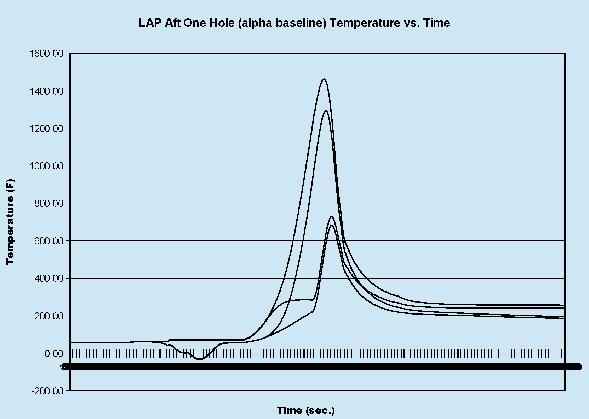

##
## III. Heating Rate vs. Time:

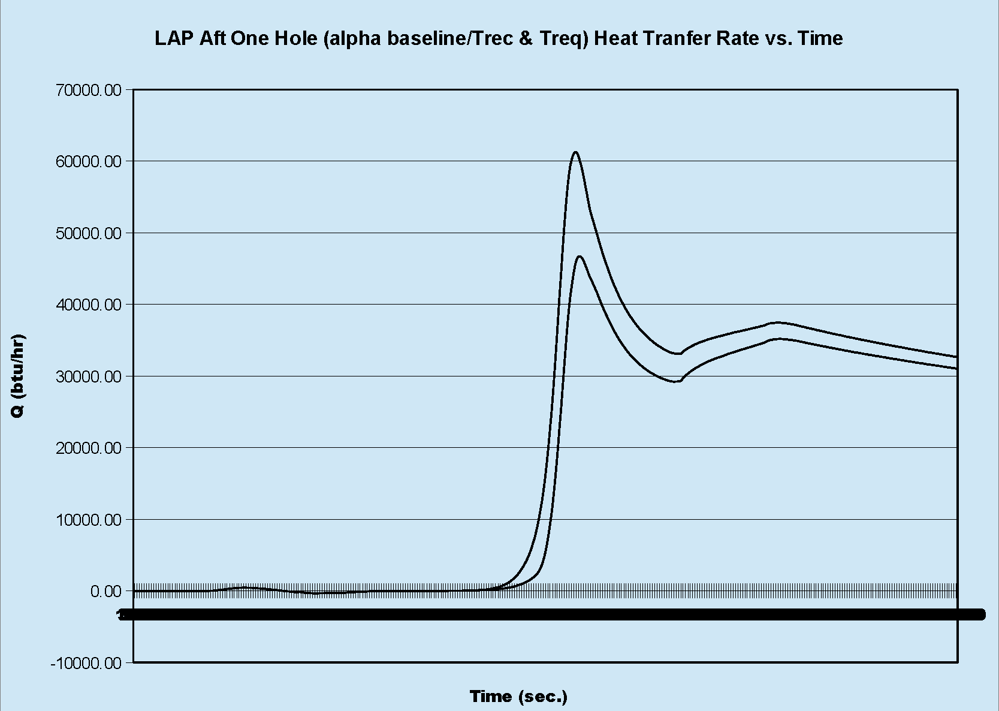

##
## IV. Ascent/Reentry Venting Thermal Analysis Top Level Diagram:

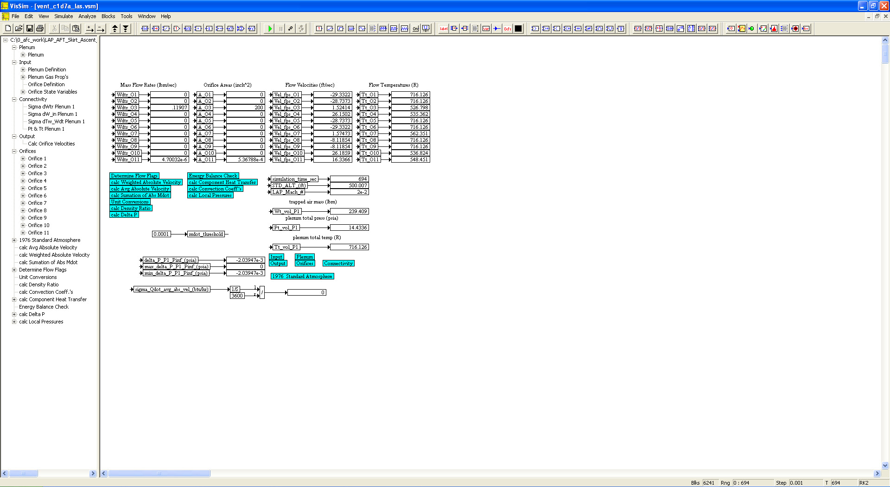

##
## V. Plenum Sub-System Level Diagram:

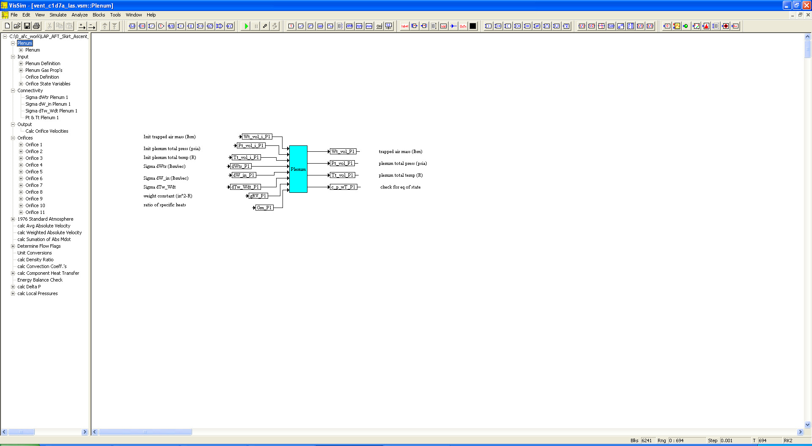
##
## VI. Input Sub-System Level Diagram:

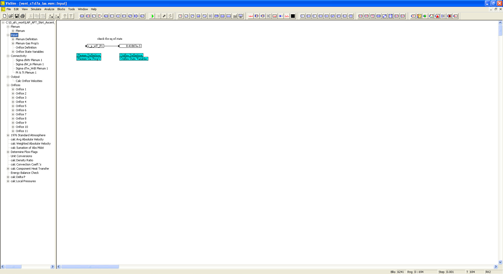
##
## VII. Connectivity Sub-System Level Diagram:

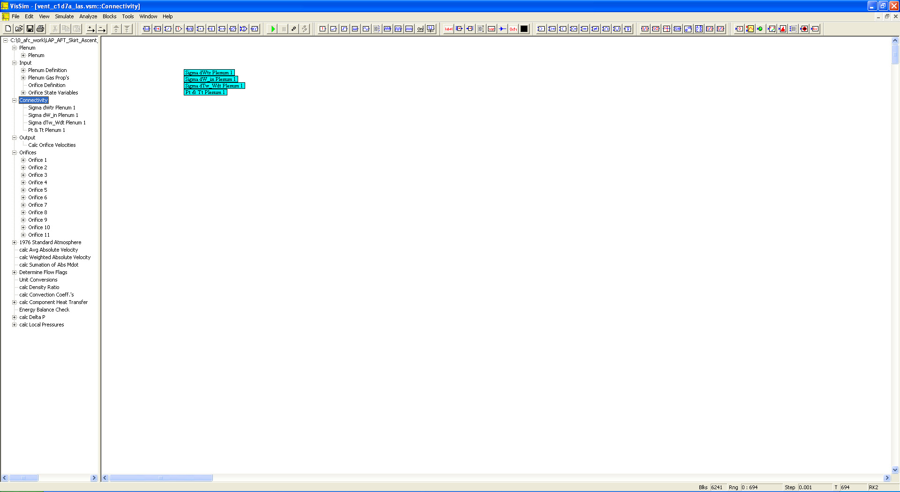
##
## VIII. Output Sub-System Level Diagram:

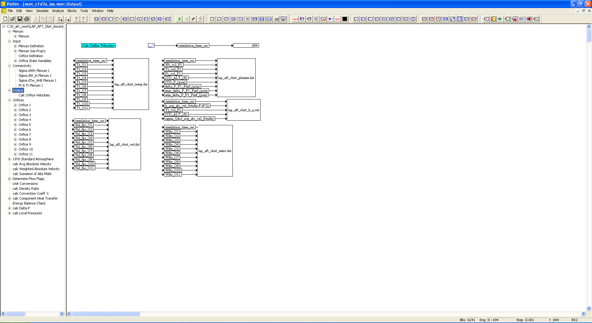
##
## IX. Orifices Sub-System Level Diagram:

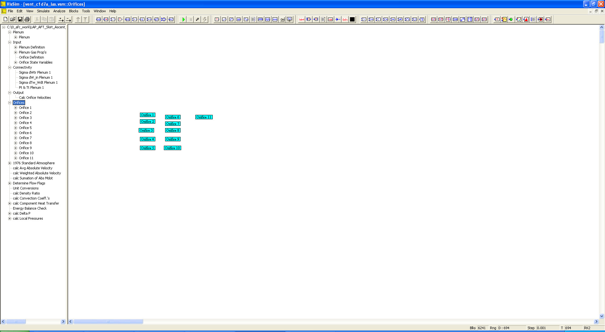
##
## X. 1976 Standard Atmosphere Model Sub-System Level Diagram:

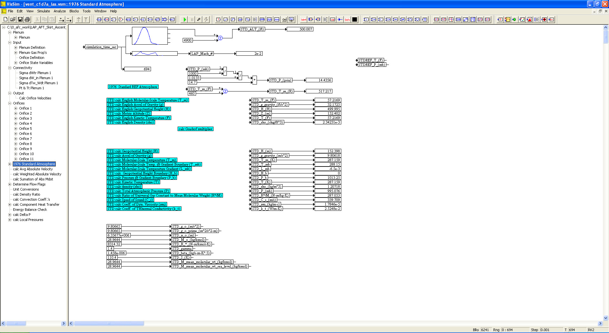
##
## XI. Component Heat Transfer Sub-System Level Diagram:

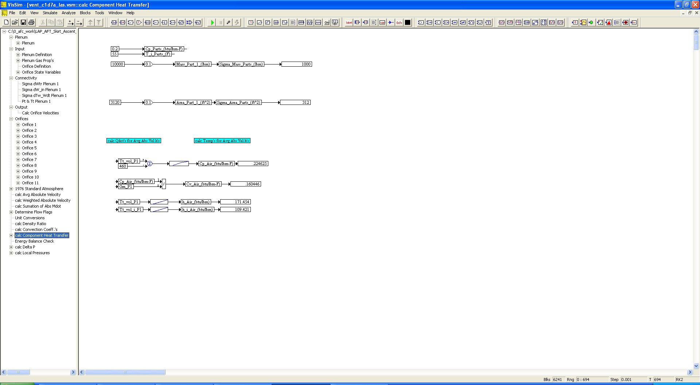
##
## XII. Delta Pressure Calculations Sub-System Level Diagram:

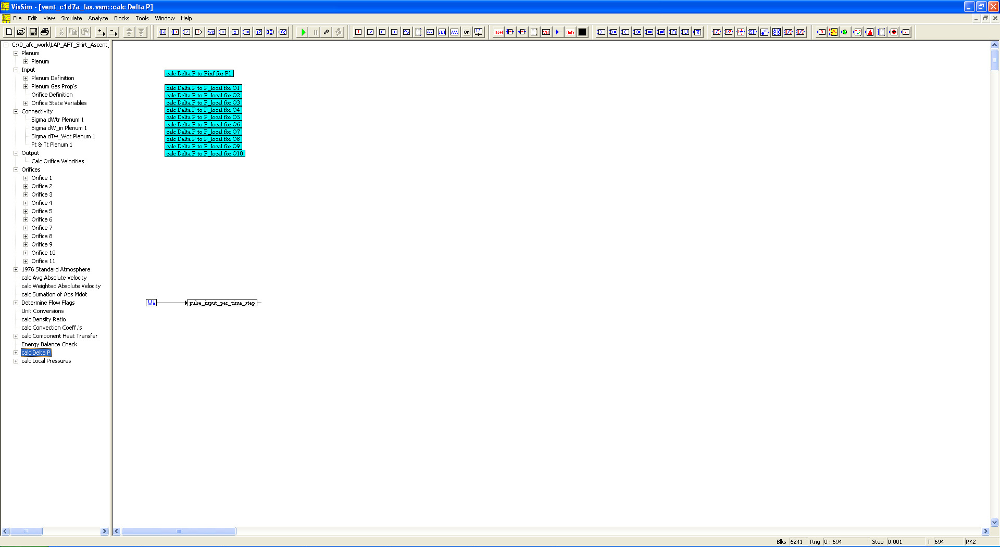
##
## XIII. Local Pressures Calculations Sub-System Level Diagram:

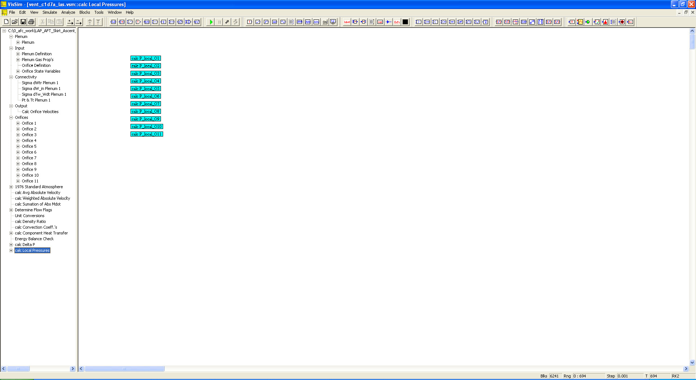
## 
## *Note: 
## 1. Performance Data and Analysis performed using VISSIM, ( https://web.solidthinking.com/vissim-is-now-solidthinking-embed )

